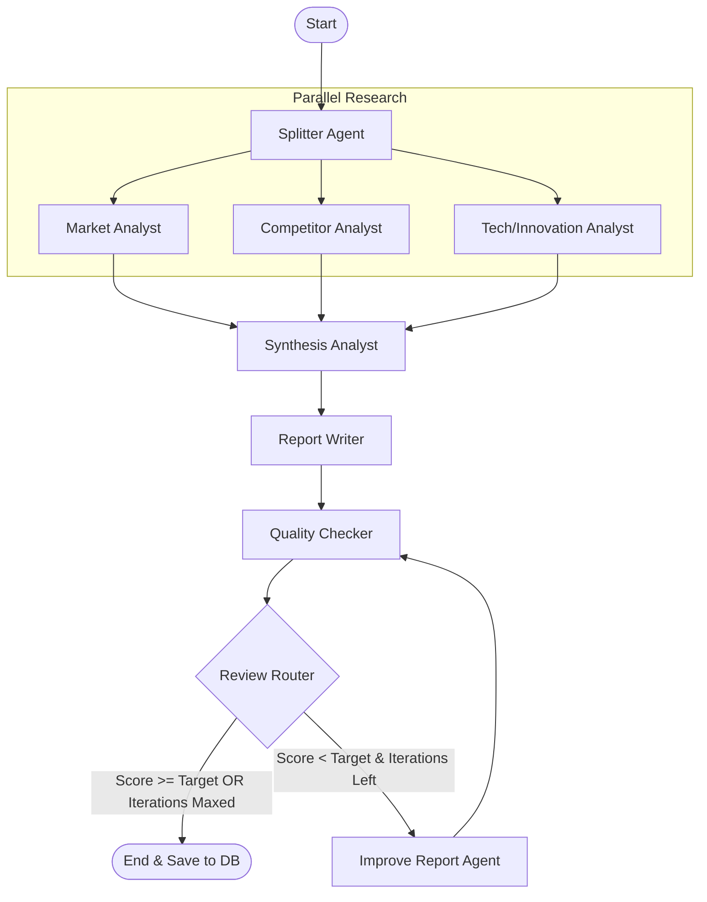

# Multi-Agent Research System

A modular research workflow implemented using LangGraph, LangChain, and SQLAlchemy. It utilizes specialized parallel agents to research market size, competitors, and technology trends for any user-provided query, synthesizes the findings, drafts a report, and iteratively refines it based on a reviewer agent's quality checks. Reports and metadata are stored in a local SQLite database and can be queried or exported to Markdown.

---

## Architecture Diagram



---

## Installation & Setup

1. **Clone the Repository** and navigate to the project directory:
   ```bash
   cd "Multi-agent Research System"
   ```

2. **Create and Activate a Virtual Environment**:
   ```bash
   python3 -m venv .venv
   source .venv/bin/activate
   ```

3. **Install Dependencies**:
   ```bash
   pip install -r requirements.txt
   ```

4. **Environment Variables**:
   Create a `.env` file in the root directory (a sample layout is shown below):
   ```env
   # LLM API keys
   OPENAI_API_KEY=your_openai_api_key
   ANTHROPIC_API_KEY=your_anthropic_api_key

   # Tavily Search Engine configuration
   TAVILY_API_KEY=your_tavily_api_key
   TAVILY_MAX_RESULTS=8
   TAVILY_TOPIC=general

   # Graph limits and thresholds
   TARGET_SCORE=0.8
   MAX_ITERATIONS=3

   # Model choices
   DEFAULT_MODEL=gpt-4o-mini
   DEFAULT_TEMPERATURE=0.0
   CREATIVE_TEMPERATURE=0.8
   ```

---

## How to Run

Execute the main entrypoint:
```bash
python main.py
```

Upon launching, the interactive command-line interface provides the following options:
1. **Start a new research workflow:**
   Enter a topic (e.g., "The future of fusion energy"), watch the parallel agents fetch findings via Tavily and compile the report, grade it against the target score, store it in the database, and optionally export the resulting report as a `.md` markdown file in your workspace.
2. **View research history:**
   Inspect previous runs stored in the local SQLite database (`research.db`), view performance scores, iterations taken, feedback, and load full report texts.
3. **Exit:**
   Terminates the CLI session.
